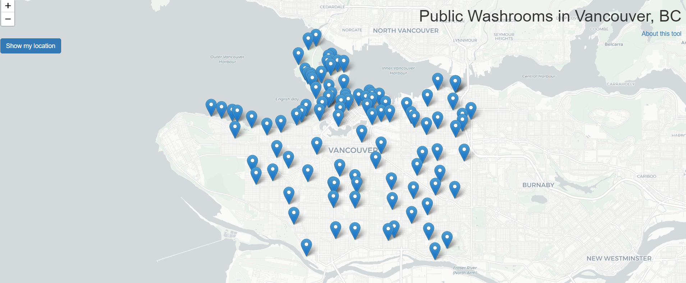

# vancouver-public-washrooms
This is an R-shiny application displaying the public and park washroom data for Vancouver, BC. The data was obtained through the open data portal for the city of Vancouver.  

You can run the application at this link: https://anagelberg.shinyapps.io/vancouver-public-washrooms/

The application currently displays data about selected washrooms and allows you to find washrooms close to your location. 

Currently in development. 
